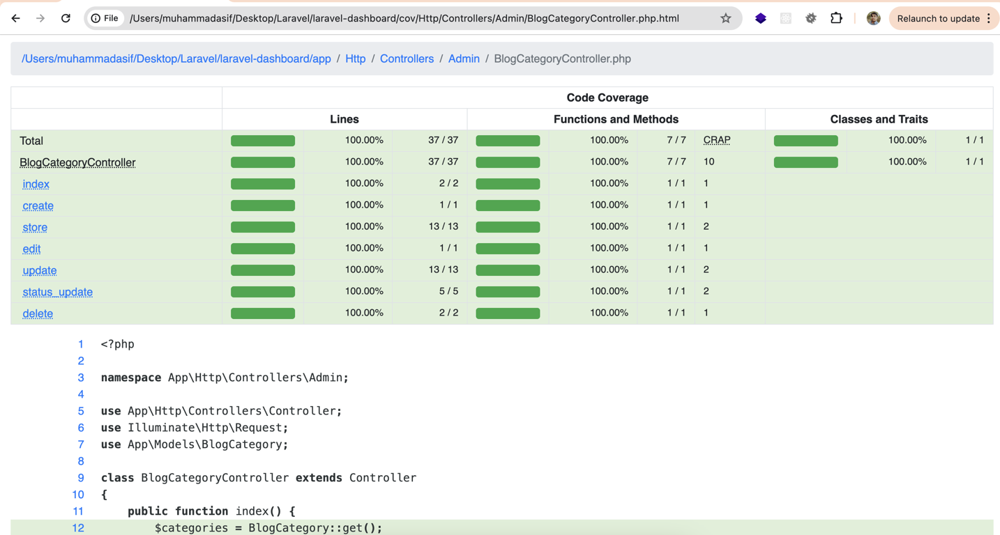

<p align="center">
    <a href="https://www.inertiapixel.com/" target="_blank">
      
    </a>
</p>

# Laravel Dashboard with PHPUnit Test Case and Maximum Code Coverage

## Overview

This repository features a Laravel-based dashboard application designed with a focus on comprehensive testing and maximum code coverage. The project utilizes PHPUnit for unit testing and Xdebug for generating detailed HTML code coverage reports.

## Features

- **Laravel Dashboard**: A fully functional Laravel application serving as a dashboard.
- **PHPUnit Tests**: Includes a suite of unit tests to ensure the application’s functionality.
- **Code Coverage**: Aims for maximum code coverage to validate the robustness of the application.
- **Xdebug Integration**: Generates pretty HTML reports for code coverage analysis.

## Installation

1. **Clone the Repository**

   ```bash
   git clone git@github.com:mdasiff/laravel-dashboard.git
   cd laravel-dashboard
2. **Install Dependencies**
Make sure you have Composer installed. Run the following command to install the PHP dependencies:
    ```bash
    composer install
3. **Set Up Environment**
Copy the `.env.example` file to `.env` and configure your environment settings.
    ```bash
    cp .env.example .env
4. **Generate an application key**
    ```bash
    php artisan key:generate
5. **Run Migrations**
Apply database migrations:
    ```bash
    php artisan migrate

## Install Xdebug
Ensure Xdebug is installed and configured for generating code coverage reports.
See how you can Install Xdebug seamlessly: https://youtu.be/Mr1s6-YfxQQ

## Running Tests and generate code ceverage report in HTML Format
To run the PHPUnit tests and generate the code coverage report, use the following command:
```bash
php artisan test --coverage-html report
```
This command will execute the tests and create an `HTML` report in the coverage directory.

## Viewing Code Coverage Report
Open the `index.html` file located in the `report` directory in your web browser to view the detailed HTML code coverage report.

## Admin Dashboard Screenshots

**Login**


**Admin Dashboard**


**Create Record View**


## PHPUnit with Xdebug Unit test Code Coverage Screenshots

**Dashboard**


**All File Report**


**All File Report**


**Controllers Coverage**


**Individual Controller Coverage**

